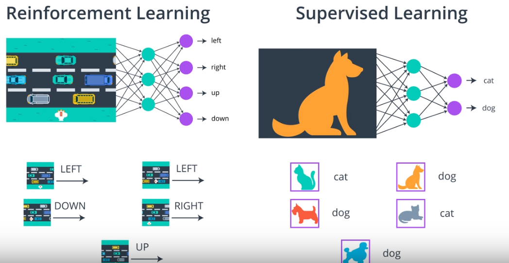

# PolicyGradientMethod-REINFORCE-drlnd

The code is based on materials from Udacity Deep Reinforcement Learning Nanodegree Program.

## Report

The policy methods are the class of RL (Reinforcement Learning) methods that do not estimate value function directly but tries to optimize the weights of the policy network that would maximize the expected return by interacting with an environment. Policy gradient methods (PGM) are a subclass of policy-based methods. PGM optimize the weights of the policy network by gradient ascent.

As it was noted by many, including [Andrej Karpathy](http://karpathy.github.io/2016/05/31/rl/), that RL shares more features with Supervised Learning. The connection with Supervised learning is pretty straightforward. Supervised learning setup, we have a bunch of labeled data that is feed into NN, in this context learning means tweaking the weights (back-propagation) of the NN to identify a given picture correctly. Changing the weights increases the probability of giving the right label. In RL setup, we collect many episodes by following some policy that is labeled at the end of the episode by winning or losing the game, and then actions are the same as pictures in Supervised learning. 

## Project Details

## Getting Started
## Instructions